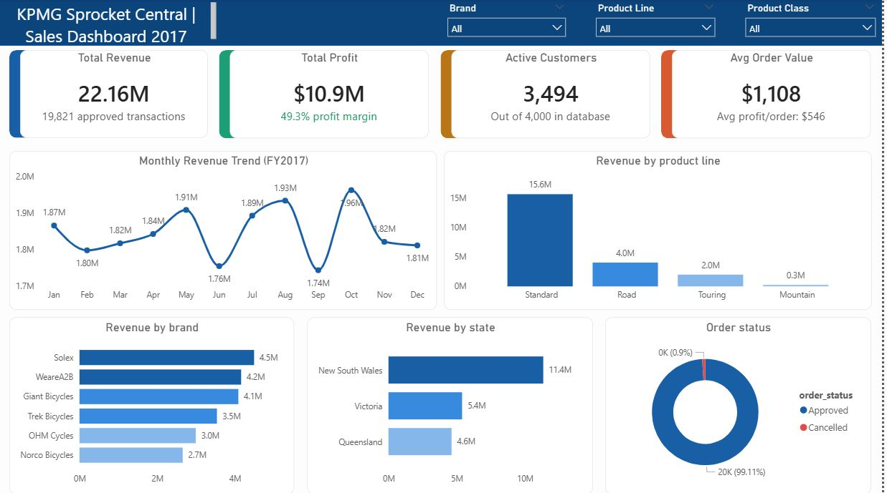
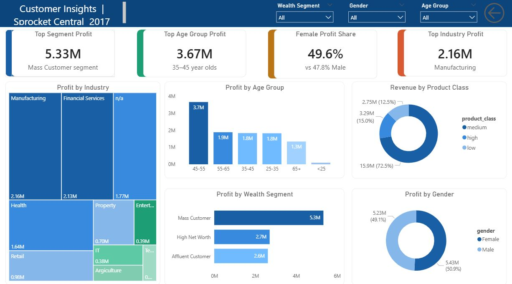
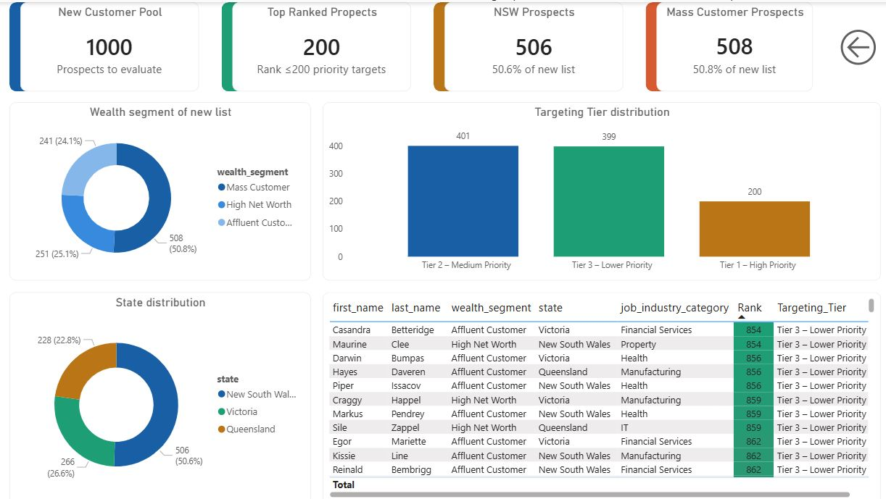

# KPMG Sprocket Central — Customer Analytics & Marketing Intelligence


> End-to-end analytics engagement for Sprocket Central Pty Ltd — a KPMG virtual internship project covering sales performance, customer segmentation, and prospect targeting across a 4,000-customer database and 1,000 new prospect list.

---

## Table of Contents

- [Executive Summary](#executive-summary)
- [Problem Statement](#problem-statement)
- [Objectives](#objectives)
- [Dataset Description](#dataset-description)
- [Data Pipeline](#data-pipeline)
- [Data Modeling](#data-modeling)
- [DAX Measures & KPIs](#dax-measures--kpis)
- [Dashboard Walkthrough](#dashboard-walkthrough)
- [Key Insights](#key-insights)
- [Strategic Recommendations](#strategic-recommendations)
- [Tools & Technologies](#tools--technologies)
- [Repository Structure](#repository-structure)
- [How to Use](#how-to-use)
- [Future Improvements](#future-improvements)
- [Author](#author)

---

## Executive Summary

Sprocket Central Pty Ltd, a mid-sized bicycle retailer, engaged KPMG's data analytics division to extract actionable intelligence from its transaction history and customer database. The engagement delivered a three-page Power BI dashboard covering FY2017 sales performance, customer profitability, and a data-driven targeting model for 1,000 new prospects.

**Business impact at a glance:**

| Metric | Value |
|---|---|
| Total Revenue (FY2017) | $22.16M |
| Total Profit | $10.9M |
| Gross Profit Margin | 49.3% |
| Active Customers | 3,494 / 4,000 |
| Average Order Value | $1,108 |
| High-Priority Prospects Identified | 200 of 1,000 |

---

## Problem Statement

Sprocket Central held significant customer and transaction data but lacked the analytical infrastructure to turn it into decisions. The business needed to answer three core questions:

1. **Where is revenue coming from, and how is it trending?** — Understanding performance by brand, product, state, and time period.
2. **Which customers are most valuable?** — Segmenting the existing base by wealth tier, demographics, and industry to identify the highest-ROI segments.
3. **Who should we target next?** — Using historical customer profiles to score and rank 1,000 new prospects for marketing prioritisation.

Without clear answers to these questions, marketing spend was undirected and new customer acquisition was left to chance.

---

## Objectives

- Analyse FY2017 transaction data to surface revenue trends and product/brand performance
- Build a customer segmentation model based on wealth segment, demographics, and purchase behaviour
- Develop a prospect scoring framework to rank the 1,000-person new customer list
- Deliver an executive-ready, interactive Power BI dashboard in three pages
- Produce evidence-based marketing and growth recommendations

---

## Dataset Description

Three primary datasets were provided by the client in Excel/CSV format:

| Dataset | Description | Key Fields |
|---|---|---|
| **Transactions** | 20,000 bicycle purchase records | transaction_id, customer_id, product_id, order_date, list_price, standard_cost, order_status |
| **Customer Demographics** | Profile data for 4,000 customers | customer_id, DOB, gender, job_industry_category, wealth_segment, owns_car |
| **Customer Address** | Address and state data | customer_id, address, state, country, property_valuation |
| **New Customers** | 1,000 prospect records | first_name, last_name, gender, DOB, job_industry_category, wealth_segment, state |

**Data quality issues identified during assessment:**

- Inconsistent gender values (`F`, `Female`, `Femal` and `M`, `Male`)
- Date of birth recorded in mixed formats (DD/MM/YYYY and MM/DD/YYYY)
- Deceased customer records present (flagged but not removed — business decision)
- Missing values in `job_industry_category` and `tenure`
- Cancelled transactions included in raw data requiring filtering

---

## Data Pipeline

```
Raw Excel/CSV → Power Query (Clean & Transform) → Data Model (Star Schema) → DAX Measures → Dashboard
```

### Data Cleaning & Transformation (Power Query)

**Transactions table:**
- Filtered to `order_status = "Approved"` only (removed 179 cancelled orders)
- Calculated `profit = list_price - standard_cost` as a new column
- Extracted `month_name` and `month_number` from `order_date` for time intelligence
- Cast data types: date columns → Date, price columns → Decimal Number

**Customer Demographics:**
- Standardised gender values to `Male` / `Female` using `SUBSTITUTE` and conditional logic
- Derived `age` from DOB using `Date.From` and `Date.Year`
- Created `age_group` bins: `<25`, `25–35`, `35–45`, `45–55`, `55–65`, `65+`
- Replaced blank `job_industry_category` with `"n/a"` for completeness

**New Customers table:**
- Applied same age and gender normalisation as the existing customer table
- Retained all 1,000 records for scoring

---

## Data Modeling

The model follows a **star schema** pattern — a single fact table surrounded by dimension tables — enabling clean DAX measures and efficient filtering.

```
Dim_Customer ────┐
Dim_Product  ────┤──── Fact_Transactions ────► Calendar
Dim_Address  ────┘
```

**Key relationships:**

| From | To | Cardinality | Active |
|---|---|---|---|
| Fact_Transactions[customer_id] | Dim_Customer[customer_id] | Many-to-One | Yes |
| Fact_Transactions[product_id] | Dim_Product[product_id] | Many-to-One | Yes |
| Fact_Transactions[order_date] | Calendar[Date] | Many-to-One | Yes |
| Dim_Customer[customer_id] | Dim_Address[customer_id] | One-to-One | Yes |

A disconnected `New_Customers` table was kept separate from the model to power the targeting dashboard independently without affecting existing customer metrics.

---

## DAX Measures & KPIs

All measures are stored in a dedicated `_Measures` table for discoverability.

```dax
-- Core revenue and profit
Total Revenue = SUMX(Fact_Transactions, Fact_Transactions[list_price])

Total Profit = SUMX(Fact_Transactions, Fact_Transactions[profit])

Profit Margin % = DIVIDE([Total Profit], [Total Revenue], 0)

-- Customer metrics
Active Customers = DISTINCTCOUNT(Fact_Transactions[customer_id])

Avg Order Value = DIVIDE([Total Revenue], [Transaction Count], 0)

Avg Profit per Order = DIVIDE([Total Profit], [Transaction Count], 0)

-- Prospect targeting
Prospect Count = COUNTROWS(New_Customers)

High Priority Count = CALCULATE([Prospect Count], New_Customers[Targeting_Tier] = "Tier 1 – High Priority")
```

---

## Dashboard Walkthrough

### Page 1 — Sales Dashboard 2017

> *Focus: Financial performance and operational overview*



**KPI cards:** Total Revenue ($22.16M), Total Profit ($10.9M), Active Customers (3,494), Avg Order Value ($1,108)

**Visuals included:**
- Monthly revenue trend line — full FY2017 seasonality view
- Revenue by brand (horizontal bar) — Solex leads at $4.5M
- Revenue by product line (bar) — Standard dominates at $15.6M (70.5%)
- Revenue by state (bar) — NSW at $11.4M, Victoria $5.4M, QLD $4.6M
- Order status donut — 99.1% approved, 0.9% cancelled

**Slicers:** Brand, Product Line, Product Class

---

### Page 2 — Customer Insights Dashboard

> *Focus: Profitability by customer segment, demographics, and industry*



**KPI cards:** Top segment profit (Mass Customer $5.33M), Top age group (35–45, $3.67M), Female profit share (50.9%), Top industry (Manufacturing $2.16M)

**Visuals included:**
- Profit by wealth segment (bar) — Mass Customer ($5.3M), High Net Worth ($2.7M), Affluent ($2.6M)
- Profit by age group (bar) — peak at 35–45 years
- Profit by industry (bar) — Manufacturing and Financial Services lead
- Profit by gender (donut) — near-equal split (Female 50.9% vs Male 49.1%)
- Revenue by product class (donut) — Medium class at 72.5%

**Slicers:** Wealth Segment, Gender, Age Group

---

### Page 3 — Customer Targeting Dashboard

> *Focus: New 1,000-prospect scoring and priority segmentation*



**KPI cards:** New Customer Pool (1,000), High-Priority Targets (200), NSW Prospects (506 / 50.6%), Mass Customer Prospects (508 / 50.8%)

**Visuals included:**
- Wealth segment distribution (donut) — Mass 50.8%, HNW 25.1%, Affluent 24.1%
- Targeting tier distribution (bar) — Tier 1: 200, Tier 2: 401, Tier 3: 399
- State distribution (donut) — NSW 50.6%, VIC 26.6%, QLD 22.8%
- Ranked prospect table — name, segment, state, industry, rank, tier

---

## Key Insights

**Financial performance:**
- Revenue was stable throughout FY2017 ($1.73M–$1.96M monthly), with a mild Q4 uplift in August and October. No single month dominates — indicating consistent, year-round demand rather than seasonal dependency.
- At 49.3%, the gross profit margin is strong for a physical goods retailer — suggesting pricing power and a lean cost structure.

**Customer segmentation:**
- Mass Customers generate $5.3M profit through sheer volume (roughly 50% of transactions). High Net Worth and Affluent customers each contribute ~25% at a near-identical average order value of ~$1,100 — equal profitability per transaction with greater upsell potential.
- The 35–45 age bracket is the highest-value demographic at $3.67M profit, followed closely by the 45–55 group.
- Female customers lead slightly at 50.9% profit share, though the gap is too small to justify gender-siloed strategy — a gender-neutral base with targeted female campaigns is the right approach.
- Manufacturing and Financial Services are the two leading industries by profit contribution.

**Product & brand performance:**
- The Standard product line alone generates $15.6M — 70.5% of total revenue. Road is a distant second at $4.0M. Mountain at $0.3M is significantly underperforming relative to shelf allocation.
- Solex leads brand revenue at $4.5M, closely followed by WeareA2B ($4.2M) and Giant Bicycles ($4.1M). Norco Bicycles trails at $2.7M and warrants a marketing budget review.

**Prospect targeting:**
- Of the 1,000 new prospects, 200 were classified as Tier 1 (High Priority) based on proximity to the highest-value existing customer profiles.
- NSW holds the largest prospect concentration (50.6%), mirroring the existing customer base — making it the primary geography for acquisition campaigns.

---

## Strategic Recommendations

| Priority | Recommendation | Rationale |
|---|---|---|
| 1 | **Dual-track customer acquisition** | Broad-reach campaigns for Mass Customers (volume) + personalised outreach for HNW/Affluent (margin). Both share equivalent AOV. |
| 2 | **Prioritise 200 Tier 1 prospects** | Start outreach with rank ≤200 targets — they match the profile of the most profitable existing customers. |
| 3 | **Concentrate geo-targeting on NSW** | NSW generates 51% of existing revenue and 50.6% of new prospects. Highest ROI geography for acquisition spend. |
| 4 | **Review the Mountain product line** | At $0.3M vs Standard's $15.6M, Mountain is either mis-priced, under-marketed, or structurally low-demand. Evaluate reprice, bundle, or discontinue. |
| 5 | **Investigate Q4 revenue drivers** | October and August show mild uplift. Understanding these peaks enables forward inventory planning and targeted promotional timing. |
| 6 | **Audit Norco Bicycles marketing spend** | Norco trails all other brands at $2.7M. Either increase support or redirect budget to Solex/WeareA2B where returns are proven. |
| 7 | **Supplement with external data** | Enrich prospect scoring with ABS demographic data, suburb-level income data, and cycling infrastructure investment signals to sharpen targeting. |

---

## Tools & Technologies

| Tool | Purpose |
|---|---|
| **Power BI Desktop** | Dashboard development, data visualisation, report publishing |
| **Power Query (M)** | Data ingestion, cleaning, type casting, feature engineering |
| **DAX** | KPI measures, calculated columns, filtering logic |
| **Excel / CSV** | Source data format |
| **Data Modeling** | Star schema design, relationship management |

---

## Repository Structure

```
kpmg-sprocket-central/
│
├── data/
│   └── KPMG_Sprocket_Dataset.csv    # Project dataset
│ 
├── screenshots/
│   ├── 01_sales_dashboard.png
│   ├── 02_customer_insights.png
│   └── 03_customer_targeting.png
│                      
├── KPMG_Sprocket_Central.pbix       # Power BI report file
│
└──  README.md                       # This file

```

---

## How to Use

1. Clone or download this repository
2. Open `KPMG_Sprocket_Central.pbix` in Power BI Desktop (version 2.120+ recommended)
3. If prompted, update the data source paths to match your local `data/raw/` directory via **Transform Data → Data Source Settings**
4. Refresh the dataset — all transformations run automatically through Power Query
5. Navigate the three report pages using the tab bar at the bottom of the canvas

> **Note:** No Power BI Pro licence is required to view the report locally in Power BI Desktop.

---

## Future Improvements

- **Predictive customer lifetime value (CLV) model** — Integrate a Python/R script visual in Power BI to score customers by predicted future value, not just historical spend.
- **Churn risk scoring** — Use recency, frequency, and monetary (RFM) analysis to flag at-risk customers before they lapse.
- **External data enrichment** — Overlay ABS postcode-level income and demographic data, Google Trends interest signals for cycling, and competitor proximity data to improve prospect scoring.
- **Real-time data connectivity** — Replace static CSV inputs with a SQL or Azure SQL Database source to enable live dashboard refresh.
- **Automated report distribution** — Configure Power BI Service scheduled refresh and email subscriptions for weekly stakeholder updates.
- **Year-over-year comparison** — Extend the dataset beyond FY2017 to enable trend analysis and growth rate tracking.

---

## Conclusion

This engagement demonstrated that Sprocket Central's existing data contains significant untapped intelligence. A 49.3% gross margin, a stable year-round revenue base, and a concentrated customer profile in NSW and the 35–45 age demographic give the business a clear strategic foundation. The prospect scoring model narrows 1,000 potential customers down to 200 high-priority targets — removing guesswork from the acquisition process and enabling efficient spend allocation.

The full Power BI dashboard provides the client with an interactive, self-service tool to continue exploring their data beyond the initial engagement.

---

## Author

**Data Analytics Portfolio Project**
Completed as part of the Edgeline Career Internship Program — Data Analytics stream.

[](https://linkedin.com)
[](https://github.com)

---

*This project was completed as part of the the Edgeline Career Internship Program . All data used is provided by the program and is publicly available for educational purposes.*
